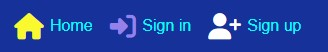

# Guild Wars 2 Forum

Guild Wars Forum is a forum/ review app for enthusiasts of the guildwars franchise. The main goal of this app is to encourage players to talk about their favourite/ least favourite things in the game, show off their gear or share thoughts on up coming content.

A community can be created in the future with the possibility of creating and finding a guild for you to play the game with.

![Image showing the website's responsiveness on different screens]

## Project Links

- [Deployed Front End Site](https://gw2-forum-3bb633979161.herokuapp.com/)

- [Repository for Front End Site](https://github.com/NatBat92/guild-wars-2-forum)

- [Deployed API Site](https://gw2forumapi-7625ca6fa938.herokuapp.com/)

- [Repository for API Site](https://github.com/NatBat92/drf-apih)

## UX Design and Planning

During the planning of this project, I considered which features and functionality should be available to the user, and how to provide these whilst maximising the user experience.

## Project Goals

A react frontend website and django backend API. Linked together to provide full CRUD functionality. 

A site that is accessed via login and provides users with the features of creating posts and comments and editing their profile. 

### The factors in setting these goals:

- Entry level knowledge and understanding of creating a React frontend and API backend.

### Project goals:

|No.|Goal|Description|
|---|---|---|
|1| Log in/log out/Sign up | User can create an account and login or log out|
|2| Posts page styled with Guild Wars theme | A responsive homepage with post CRUD functionality|
|3| Comments | Comments for each post with CRUD functionality|
|4| Profiles (Created on new account) | Profiles with full CRUD Functionality |
|5| Front-end react website and custom built API| Hosted on Heroku |
|6| Deployment of final website to Heroku | Upon project completion | 
|7| Document all known bugs and issues | Ensure documentation is clear and honest |

## User Stories

An agile development strategy was implemented in this project as user stories were created as 'Issues' on GitHub. Each user story was listed and check boxes were used on ones which required multiple steps. Each time a task was complete i would tick the box until all steps were ticked off and i could resolve the issue. 

### Setup

1. As a **user** I can **view a navbar on each page** so that **I can use the links to change my current page**.
2. As a **user** I can **navigate through pages quickly** so that **I can view content seamlessly without page refresh**.
3. As a **user** I can **tell if I am logged in or not so that I can log in if I need to**.
4. As a **user** I can **maintain logged in until I choose to log out so that I don’t have to log in all-time**.
5. As a **user** I can **create a list of my favourites posts**.

### Posts

1. As a **logged in user** I can **create posts**.
2. As a **user** I can **delete my posts**.
3. As a **user** I can **edit my posts title and description**.
4. As a **user** I can **view the details of a single post so that I can learn more about it**.
5. As a **user** I can **view all the most recent posts, ordered by most recently created first so that I am up to date with the newest content**.
6. As a **user** I can **search for posts and categories so that I can find specific themes**.
7. As a **user** I can **view all the posts by a specific user so that I can catch up on their latest posts, or decide I want to follow them**
8. As a **user** I can **view the details of a single post so that I can learn more about it**

### Comments

1. As a **logged in user**, I can **create a comment on a post** so that **I can share my opinion**.
2. As a **user**, I can **view comments on a post** so that **I can read other users’ opinions**.
3. As a **comment author**, I can **edit my comment**.
4. As a **comment author** I can **delete my comments**.

### Favourites

1. As a **logged in user**, I can **favourite a post** so that **I can save my favourite posts**.
2. As a **loggeed in user**, I can **view my favourite posts in a feed** so that **I can revisit my favourite posts**.
3. As a **logged in user**, I can **remove a favourite on a post** so that **it no longer appears in my favourites feed**.

### Profile

1. As a **user** I can **sign in to the app so that I can access functionality for logged in users**.
2. As a **logged user** I can **update my username and password so that I can change my display name and keep my profile secure**.
3. As a **user** I can **see all my uploaded posts**.
4. As a **logged user** I can **view content filtered by users I follow so that I can keep up to date with what they are posting about**.
5. As a **user** I can **view user's avatars so that I can easily identify users of the application**.
6. As a **user** I can **follow and unfollow other people**.
7. As a **user** I can **view statistics about a specific user: bio, number of posts, follows and users followed**.
8. As a **user** I can **see a list of the most followed profiles so that I can see which profiles are popular**.

### Contact Us

1. As a **user** I can **sign in to the app and send a message to the admin to report posts/ comments**.

## Features

### Landing page

- Styled to give the feel of a video gamer database login

- user can only login from this screen

### Navigation 

- Displays the brand logo and name of the website to the user.

- A royal blue background color and white font color provides sufficient contrast so the links are clearly visible.

- A purple hover effect also provides sufficient contrast and improves the user experience by showing that the links are clickable. 

- On screens sizes with sufficient space, 'Font Awesome' icons are used for extra clarity of the links.

- The active page's nav link appears green to indicate to the user which page they are currently viewing.

- Allows the user to navigate between pages on the website.

- On smaller screens, a hamburger icon appears and opens a dropdown menu when clicked, displaying all of the navbar links. This provides a better user experience as the navbar doesn't have to take up unnecessary space and it maximises the space for other content.

- On smaller screens, the navbar automatically closes after clicking a nav link or clicking off of the nav bar to provide a better users experience.

- Conditional rendering is used to display different nav links to users that are logged in and logged out. This limits users to being able to only use site functionality relevant to their log in status.

- Users are able to see their log in avatar in the navbar.

![profile]

### Sign Up

- Allows users to sign up for an account on the website.

- The 'Sign Up' title makes it obvious to the user that they are on the sign up page and avoids confusion with the 'Sign In' page.

- Users should input a username and the same password into the 'New Password' and 'Confirm Password' fields. Validation is present to detect errors, such as when the passwords don't match or when a field is blank. Alerts explain the errors if the users try to submit an invalid form.

- A link is available for users to be redirected to the 'Sign In' page if they already have an account.

- By clicking the 'Sign Up' button, the form is submitted and the user is redirected to the 'Home' page.

### Sign In

- Allows users to sign into their account on the website.

- The 'Sign In' title makes it obvious to the user that they are on the sign in page and avoids confusion with the 'Sign Up' page.

- Users should input a username and password. Validation is present to detect errors, such as when the username or password is incorrect and when a field is blank. Alerts explain the errors if the users try to submit an invalid form.

- A link is available for users to be redirected to the 'Sign Up' page if they don't already have an account.

- By clicking the 'Sign In' button, the form is submitted and the user is redirected to the 'Home' page.

### Home Page

- Displays the most recent posts to the user in a continuous feed.

- Controls section at the top of the page includes a search bar, favourites, contact us and add post button. These are above the posts so that the user is instantly aware that they can manipulate the page content.

- Search bar allows users to search for posts on the website by title or user's name. 

- Add Post button allows users to be redirected to the 'Create Post' page, where they can add their own post to the website. The button only appears if the current user is logged in.

- Each post clearly shows information such as the author, date created, title and description and image. Clicking on the post image will redirect users to the 'Post' page, where they can find more details. Clicking on the profile image will redirect users to the author's 'Profile' page

- Display the most followed profiles with the possibilty to follow/unfollow a profile.

- Buttons are present at the bottom of the post to allow the user to comment, add favourite and like the post.

- By clicking the comment button, users are redirected to the 'Post' page, where a comment form is below the post.

- By clicking the favourite button, users can add the post to their favourites feed. The favourite icon colour will become solid to inform the user that their favourite has been registered.

- By clicking the a like button, the count for the option will increment by 1 and the icon colour will become solid.

### Post Page

![post view]

- Shows a specific, single post, with more details such as by showing the 'Add Comment' form, comments and more options dropdown. 

- Accessed by clicking on a post's image.

- The 'Add Comment' form is only visible for logged in users, however all users can view the comments on a post.

- Comments are ordered in a list, with the most recent comments appearing at the top.

- Comments show the content, date/time updated, author's name and author's profile image.

- Infinite scrolling is present for posts that have more than 10 comments.

- If ther current user is the author of the post, a more options dropdown button will appear as three dots. When clicked, the user can select the pencil button to be redirected to the 'Edit Post' page, or the bin to delete the post.

- If ther current user is the author of the comment, a more options dropdown button will appear as three dots. When clicked, the user can select the pencil button to load the 'Edit Comment' form, or the bin to delete the comment.

### Profile view

![profile view]

- Find the posts created by the user

- See the number of posts

- See the number of followers

- See the number of following

- Owner can choose to edit, change username and change password

### Favourites Page

- Functions identically to the home page but only displays a feed of posts that the logged in user has favourited.

- If the user is yet to favourite a post, the user receives a message explaining that they need to favourite a post first.

